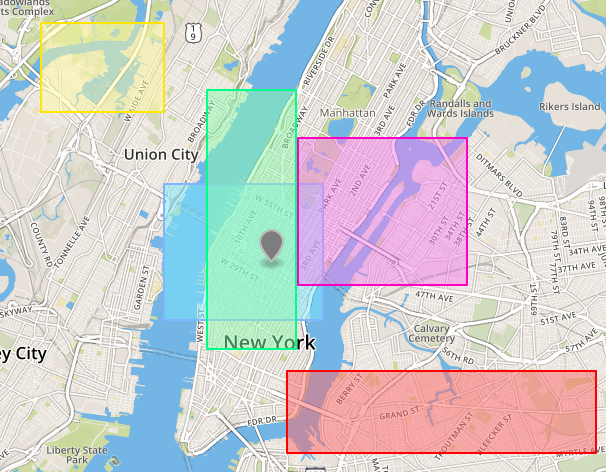

# PredExpNode Class

PredExpNode can be used to create filters for queries to exclude or include records with selected bins. Apply the filter by using methods from [AerospikeC::PredExp](predexp.md): ([#where](predexp.md#where), [#and](predexp.md#and), [#or](predexp.md#or))

Example of applying the filter:
```ruby
q_range = AerospikeC::Query.new("test", "query_test")
q_range.range!("int_bin", 5, 10)
predexp = AerospikeC::PredExp.new
predexp.where(predexp[:int_bin].eq(7))
```

With a new operation, you can use any of the methods specified below:

- [Methods](#methods)
  - [#initialize](#initialize)
  - [#eq](#eq)
  - [#not_eq](#not_eq)
  - [#gt](#gt)
  - [#gteq](#gteq)
  - [#lt](#lt)
  - [#lteq](#lteq)
  - [#regexp](#regexp)
  - [#contains](#contains)
  - [#within](#within)
  - [#not](#not)
  - [#and](#and)
  - [#or](#or)
  - [#last_update](#last_update)
  - [#void_time](#void_time)
  - [#list_and](#list_and)
  - [#list_or](#list_or)
  - [#map_key_and](#map_key_and)
  - [#map_key_or](#map_key_or)
  - [#map_val_and](#map_val_and)
  - [#map_val_or](#map_val_or)
  - [#node](#node)

<a name="methods"></a>
## Methods

<!--===============================================================================-->
<!-- initialize -->
<a name="initialize"></a>

### initialize(value)

Create a new object.
Object also can be created by using [AerospikeC::PredExp#[]](predexp.md#ary)

Parameters:

- `value` - value of bin - String or Symbol

Example:

```ruby
node = AerospikeC::PredExpNode.new(:int_bin)

# AerospikeC::PredExp#[]
predexp = AerospikeC::PredExp.new
predexp[:string_bin]
```

<!--===============================================================================-->
<hr/>
<!-- eq -->
<a name="eq"></a>

### eq(val)

Return all records with bin being equal to the chosen value `val`

Parameters:

- `val` - Value to compare to - accepts Integer and String

Retrun `self`

Example:

```ruby
node = AerospikeC::PredExpNode.new(:int_bin)
node.eq(5)

predexp = AerospikeC::PredExp.new
predexp[:string_bin].eq("string")
```

<!--===============================================================================-->
<hr/>
<!-- not_eq -->
<a name="not_eq"></a>

### not_eq(val)

Return all records with bin being NOT equal to the chosen value `val`

Parameters:

- `val` - Value to compare to - accepts Integer and String

Retrun `self`

Example:

```ruby
node = AerospikeC::PredExpNode.new(:int_bin)
node.not_eq(5)

predexp = AerospikeC::PredExp.new
predexp[:string_bin].not_eq("string")
```

<!--===============================================================================-->
<hr/>
<!-- gt -->
<a name="gt"></a>

### gt(val)

Return all records with bin value being greater than value `val`

Parameters:

- `val` - Value to compare to - accepts Integer

Retrun `self`

Example:

```ruby
node = AerospikeC::PredExpNode.new(:int_bin)
node.gt(5)
```

<!--===============================================================================-->
<hr/>
<!-- gteq -->
<a name="gteq"></a>

### gteq(val)

Return all records with bin value being greater or equal to value `val`

Parameters:

- `val` - Value to compare to - accepts Integer

Retrun `self`

Example:

```ruby
node = AerospikeC::PredExpNode.new(:int_bin)
node.gteq(5)
```

<!--===============================================================================-->
<hr/>
<!-- lt -->
<a name="lt"></a>

### lt(val)

Return all records with bin value being less than value `val`

Parameters:

- `val` - Value to compare to - accepts Integer

Retrun `self`

Example:

```ruby
node = AerospikeC::PredExpNode.new(:int_bin)
node.lt(5)
```

<!--===============================================================================-->
<hr/>
<!-- lteq -->
<a name="lteq"></a>

### lteq(val)

Return all records with bin value being less or equal to value `val`

Parameters:

- `val` - Value to compare to - accepts Integer

Retrun `self`

Example:

```ruby
node = AerospikeC::PredExpNode.new(:int_bin)
node.lteq(5)
```

<!--===============================================================================-->
<hr/>
<!-- regexp -->
<a name="regexp"></a>

### regexp(val)

Return all records with bin value matching regular expression in `val`

Parameters:

- `val` - Value to compare to - accepts String

Retrun `self`

Example:

```ruby
node = AerospikeC::PredExpNode.new(:string_bin)
node.regexp("hay")
```

<!--===============================================================================-->
<hr/>
<!-- contains -->
<a name="contains"></a>

### contains(val)

Return all records with bin contained in the area provided in `val`(Blue polygon):


Parameters:

- `val` - AerospikeC::GeoJson value to check

Retrun `self`

Example:

```ruby
area = AerospikeC::GeoJson.circle([20.564002990722656, 53.750943916700976], 1000)
node = AerospikeC::PredExpNode.new(:geojson_bin)
node.contains(area)
```

<!--===============================================================================-->
<hr/>
<!-- within -->
<a name="within"></a>

### within(val)

Return all records with area bin within in the point/area provided in `val`(Grey point):



Parameters:

- `val` - AerospikeC::GeoJson value to check

Retrun `self`

Example:

```ruby
point = AerospikeC::GeoJson.point(20.564002990722656, 53.750943916700976)
node = AerospikeC::PredExpNode.new(:geojson_bin)
node.within(point)
```

<!--===============================================================================-->
<hr/>
<!-- not -->
<a name="not"></a>

### not

Negates the filter.

Retrun `self`

Example:

```ruby
node = AerospikeC::PredExpNode.new(:int_bin)
node.not.eq(5)
```
